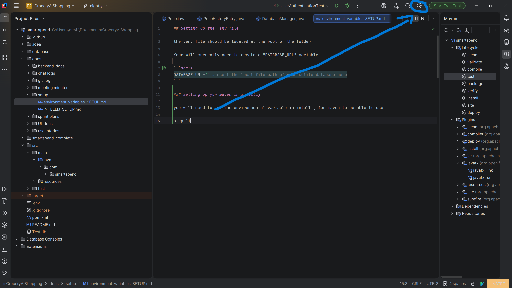
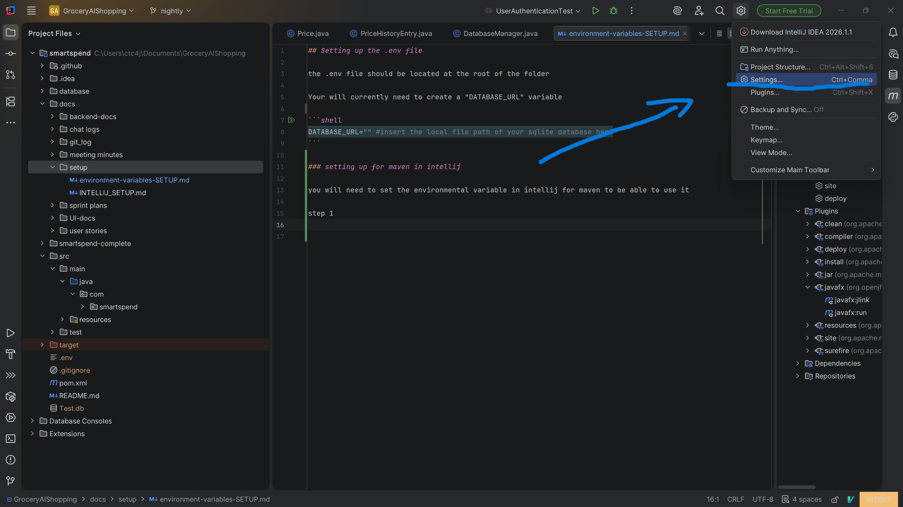
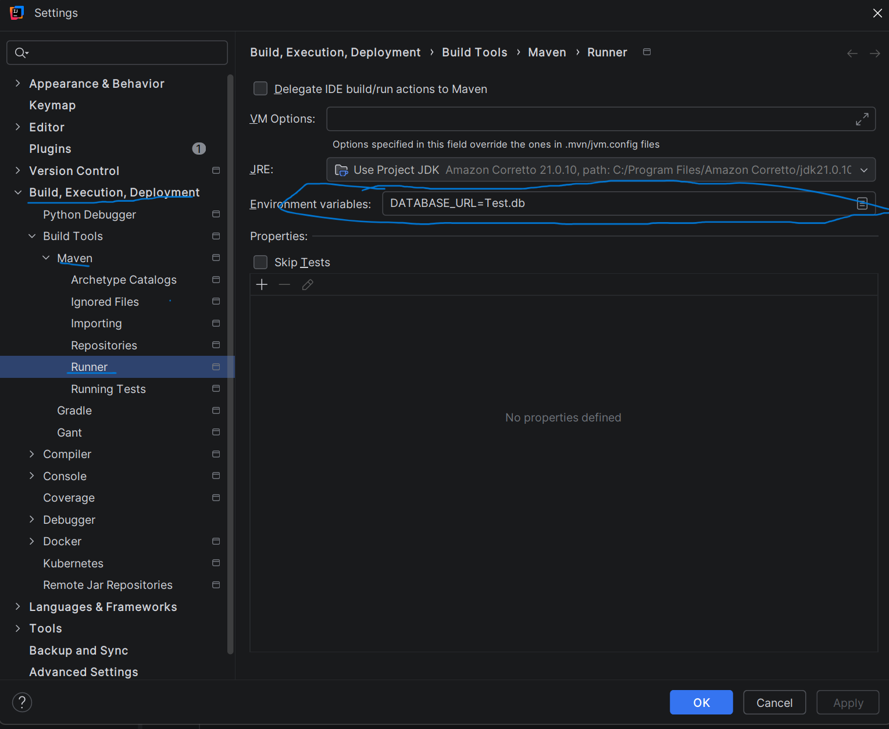
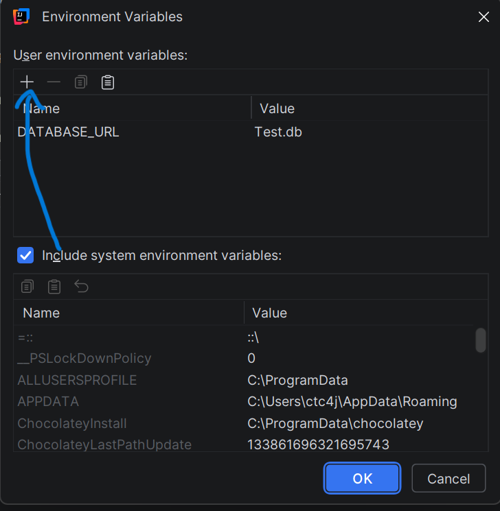

## Setting up the .env file

the .env file should be located at the root of the folder

Your will currently need to create a "DATABASE_URL" variable
    
```shell
DATABASE_URL="" #insert the local file path of your sqlite database here
```

### setting up for maven in intellij

you will need to set the environmental variable in intellij for maven to be able to use it

## step 1: go to the settings menu





## step 2: in the settings menu go to maven settings

under "Build, Execution, Deployment" -> Build Tools -> Maven -> Runner



## step 3: click on the icon on the left most side of the environmental variables section


## step 4: add the environmental variable
"Name" column should be "DATABASE_URL"
"value" column should be your local path to your db (starting from the root folder)

